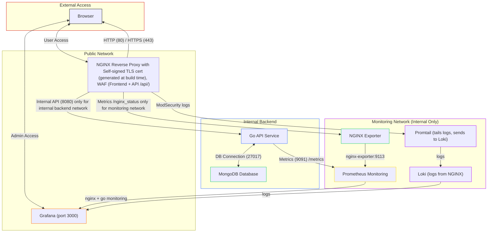
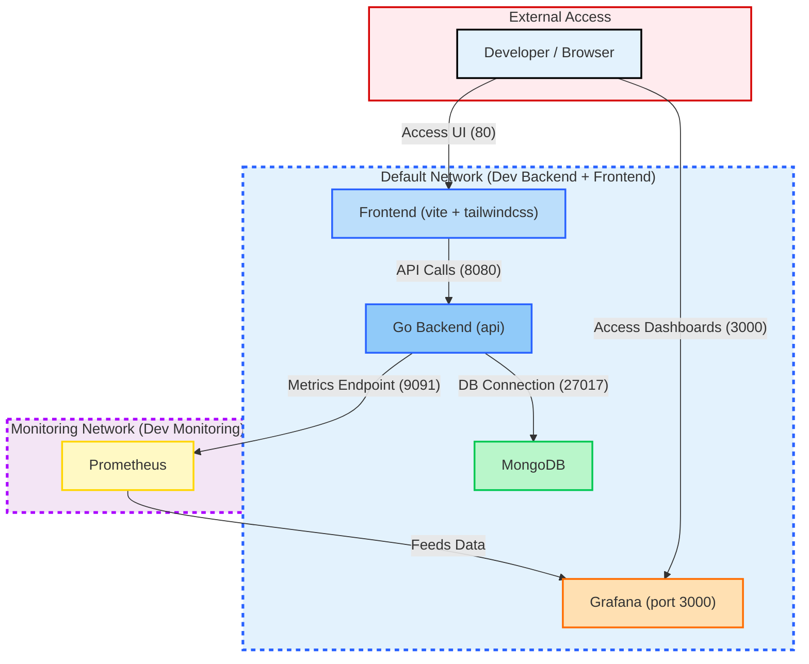

# go-alpinejs-mongodb-stack
go alpinejs mongodb stack
### Production Graph

### Development Graph


to use grafana with prometheus go to http://localhost:3000/
```bash
http://prometheus:9090
```

start:
```bash
cd frontend/ ; npm install; ../develop.sh;
```
